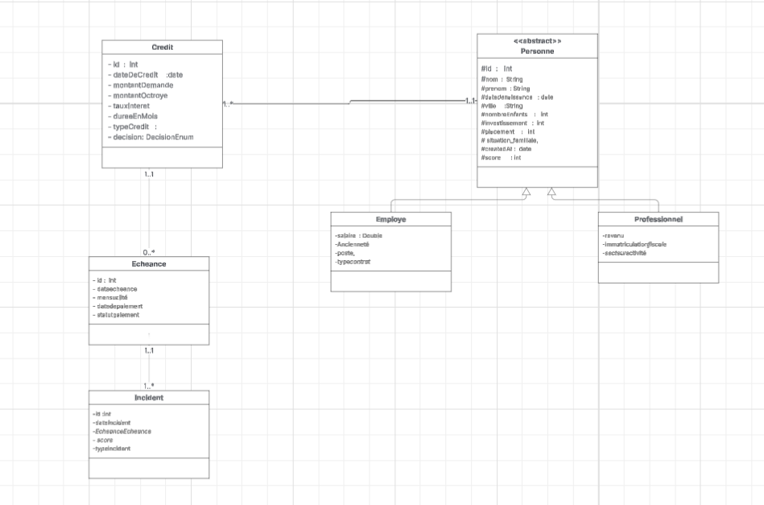

# Système de Scoring Automatisé pour la Micro-Finance

## Contexte du projet
Le secteur de la micro-finance au Maroc fait face à des défis majeurs dans l'évaluation du risque crédit :
- Processus manuels et chronophages
- Décisions subjectives
- Exclusion de profils potentiellement solvables

Les méthodes traditionnelles ne répondent plus aux exigences de rapidité, précision et traçabilité du marché moderne. Ce projet vise à développer un **système de scoring automatisé** en **Java pur** pour transformer l'octroi de crédit grâce à un scoring intelligent, réduire les risques et améliorer l'accès au financement.

---

## 🛠️Diagramme de classes ## 

---

## Objectifs
- Implémenter des **algorithmes de scoring** basés sur 5 composants métier :
    1. Stabilité professionnelle
    2. Capacité financière
    3. Historique
    4. Relation client
    5. Patrimoine
- Créer un **moteur de décision automatique**
- Assurer une **historisation complète** pour audit
- Faciliter l’accès au crédit avec un scoring précis et rapide

---

## Structure de l'application
1. **Couche de présentation (UI/Menu)**
2. **Couche métier**
3. **Couche utilitaire**
4. **Couche repository**

---

## Fonctionnalités principales

### Module 1 : Gestion des clients
- Créer un nouveau client
- Modifier les informations client
- Consulter le profil client
- Supprimer un client
- Lister tous les clients

### Contenu des classes
- **Classe abstraite `Personne`** : `nom`, `prenom`, `dateDeNaissance`, `ville`, `nombreEnfants`, `investissement`, `placement`, `situationFamiliale`, `createdAt`, `score`
- **Classe `Employe`** (hérite de `Personne`) : `salaire`, `anciennete`, `poste`, `typeContrat`, `secteur` (`public`, `grande entreprise`, `PME`)
- **Classe `Professionnel`** (hérite de `Personne`) : `revenu`, `immatriculationFiscale`, `secteurActivite` (`agriculture`, `service`, `commerce`, `construction`, ...), `activite` (ex : `Avocat`, `Mecanicien`, ...)

---

## Composants du modèle de Scoring Crédit

1. **Stabilité professionnelle (30 pts)**
    - Type d'emploi et ancienneté
2. **Capacité financière (30 pts)**
    - Niveau de revenus
3. **Historique (15 pts)**
    - Incidents de paiement, retards et impayés
4. **Relation client (10 pts)**
    - Pour nouveaux clients : âge, situation familiale, enfants
    - Pour clients existants : ancienneté relation
5. **Critères complémentaires (10 pts)**
    - Patrimoine : investissements/placements

---

## Critères d'éligibilité par profil

### Profil 1 - Nouveau client
- Emploi fixe avec expérience > 2 ans
- Montant max : 4x le salaire mensuel
- Score minimum requis : 70/100

### Profil 2 - Client existant
- Historique client positif
- Montant max : 7x le salaire mensuel
- Score minimum requis : 60/100

---

## Règles de décision automatique
- Score ≥ 80 : **ACCORD IMMÉDIAT**
- Score 60-79 (nouveau) / 50-79 (existant) : **ÉTUDE MANUELLE**
- Score < 60 (nouveau) / < 50 (existant) : **REFUS AUTOMATIQUE**

---

## Gestion des impayés et retards
- **Impayé** : échéance non payée, 31+ jours après échéance
- **Retard** : échéance payée après la date limite, 5-30 jours après échéance

---

## Stratégies d’historisation
1. **Sauvegarde à chaque calcul simple** : chaque calcul de score est enregistré
2. **Sauvegarde sur événements** : uniquement lors de changements (nouveau paiement, retard, impayé, demande crédit)
3. **Snapshot périodique** : snapshot quotidien ou hebdomadaire via cron jobs

---

## Technologies utilisées
- Java 8+ (Java pur)
- Collections, Streams, Lambda expressions
- Gestion des dates et historiques
